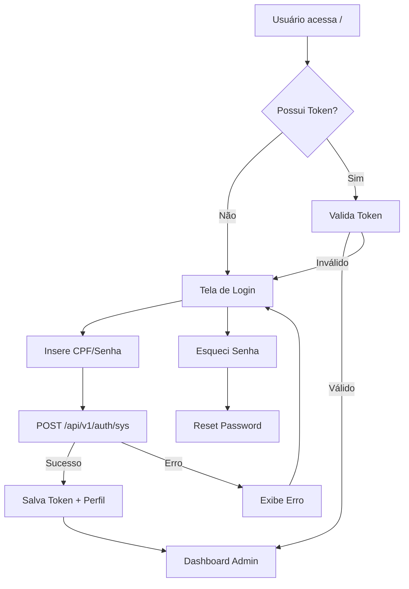
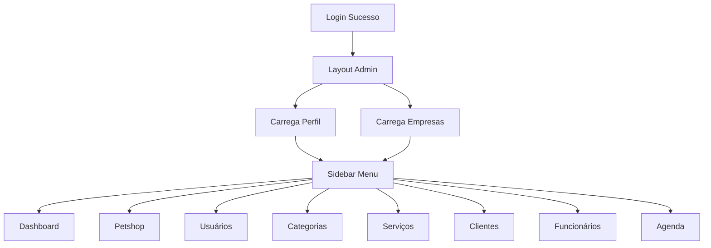
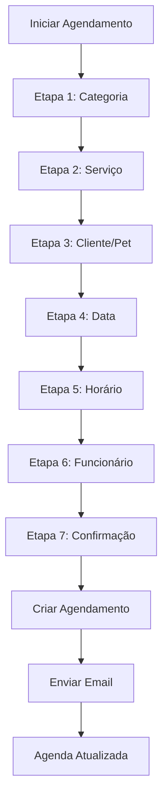
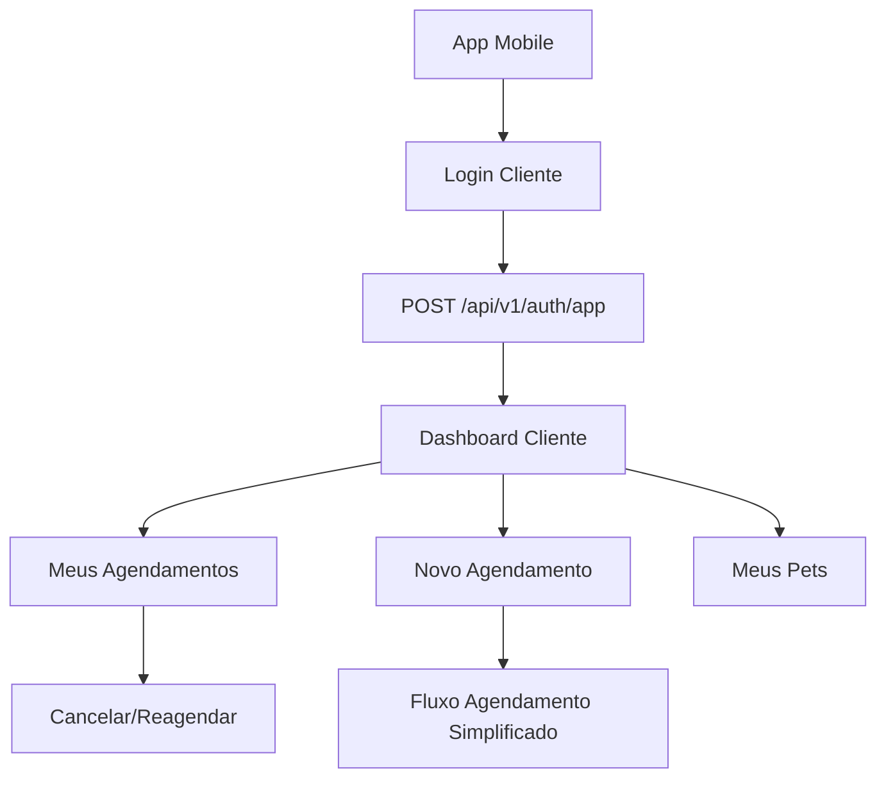
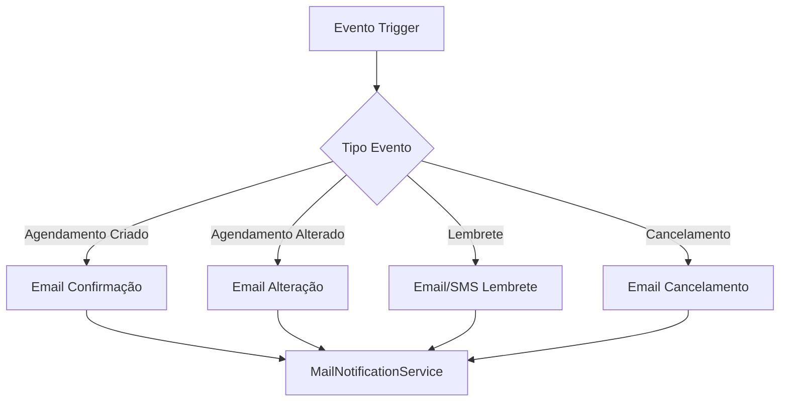
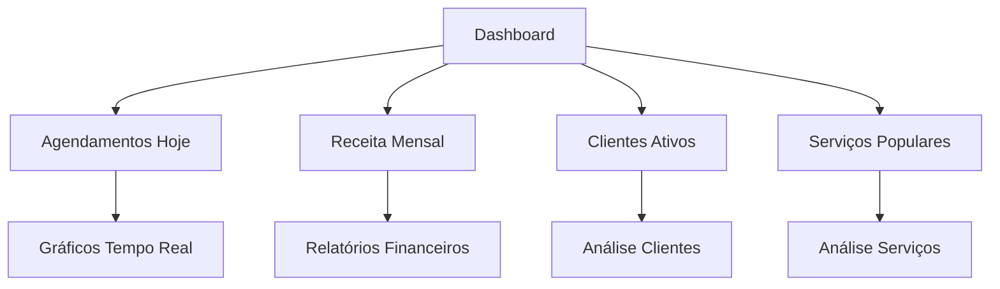
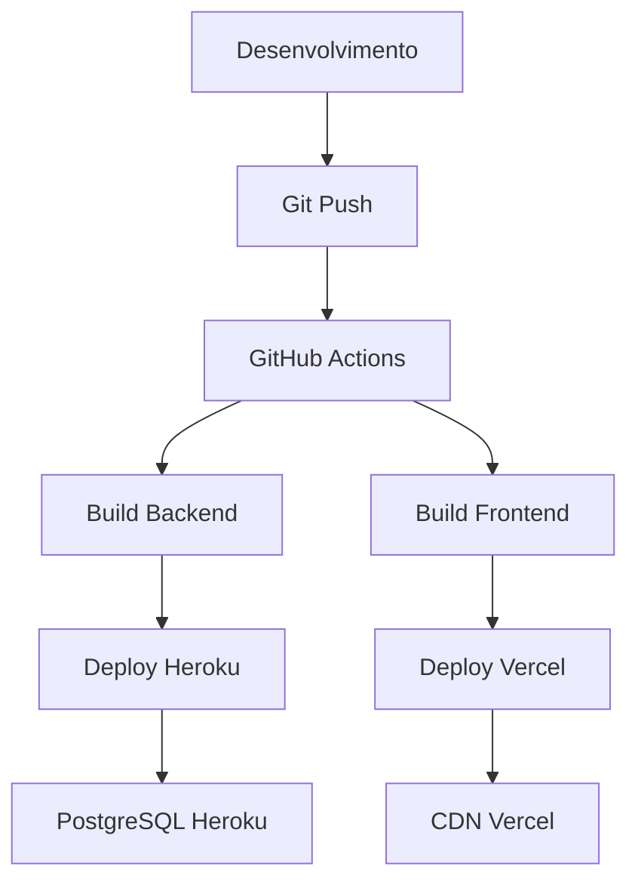

# 🐾 FLUXO DA APLICAÇÃO - SISTEMA PET SHOP

## 📋 VISÃO GERAL
Sistema completo de gestão para pet shops com fluxo de agendamento, administração e controle de usuários.

---

## 🔐 1. FLUXO DE AUTENTICAÇÃO



### Endpoints de Autenticação:
- `POST /api/v1/auth/sys` - Login sistema
- `POST /api/v1/auth/app` - Login app mobile
- `POST /api/v1/auth/forget` - Recuperar senha

---

## 🏠 2. DASHBOARD ADMINISTRATIVO



### Módulos Principais:
- **Dashboard**: Visão geral e métricas
- **Petshop**: Gestão de empresas/filiais
- **Usuários**: CRUD de usuários do sistema
- **Categorias**: Tipos de serviços
- **Serviços**: Produtos/serviços oferecidos
- **Clientes**: Gestão de clientes e pets
- **Agenda**: Controle de horários e agendamentos

---

## 📅 3. FLUXO DE AGENDAMENTO (7 ETAPAS)



### Detalhamento das Etapas:

#### 🎯 Etapa 1: Seleção de Categoria
- **Rota**: `/scheduling-01`
- **API**: `GET /api/v1/categories?companyId={id}&active=true`
- **Ação**: Usuário seleciona tipo de serviço (Banho, Tosa, Veterinário, etc.)

#### 🛍️ Etapa 2: Seleção de Serviço
- **Rota**: `/scheduling-02`
- **API**: `GET /api/v1/products?categoryId={id}&active=true`
- **Ação**: Escolhe serviço específico dentro da categoria

#### 👤 Etapa 3: Cliente e Pet
- **Rota**: `/scheduling-03`
- **API**: `GET /api/v1/customers` + `GET /api/v1/pets`
- **Ação**: Seleciona cliente existente ou cadastra novo + seleciona pet

#### 📆 Etapa 4: Seleção de Data
- **Rota**: `/scheduling-04`
- **API**: `GET /api/v1/appointments/month?companyId={id}&productId={id}`
- **Ação**: Visualiza calendário com disponibilidade dos próximos 3 meses

#### ⏰ Etapa 5: Seleção de Horário
- **Rota**: `/scheduling-05`
- **API**: `GET /api/v1/appointments/day?date={date}&companyId={id}&productId={id}`
- **Ação**: Escolhe horário disponível no dia selecionado

#### 👨‍💼 Etapa 6: Seleção de Funcionário
- **Rota**: `/scheduling-06`
- **API**: `GET /api/v1/users?role=EMPLOYEE&available=true`
- **Ação**: Seleciona funcionário disponível (opcional)

#### ✅ Etapa 7: Confirmação
- **Rota**: `/scheduling-07`
- **API**: `POST /api/v1/appointments`
- **Ação**: Revisa dados e confirma agendamento

---

## 🔄 4. FLUXO DE GESTÃO DE DADOS

### 🏢 Gestão de Empresa
```mermaid
graph TD
    A[/company] --> B[Lista Empresas]
    B --> C[Criar Nova]
    B --> D[Editar Existente]
    C --> E[Formulário Criação]
    D --> F[Formulário Edição]
    E --> G[POST /api/v1/companies]
    F --> H[PUT /api/v1/companies/{id}]
```

### 👥 Gestão de Usuários
```mermaid
graph TD
    A[/user] --> B[Lista Usuários]
    B --> C[Criar Usuário]
    B --> D[Editar Usuário]
    B --> E[Alterar Senha]
    C --> F[POST /api/v1/users]
    D --> G[PUT /api/v1/users/{id}]
    E --> H[PATCH /api/v1/users/password]
```

### 🐕 Gestão de Clientes/Pets
```mermaid
graph TD
    A[/customer] --> B[Lista Clientes]
    B --> C[Criar Cliente]
    B --> D[Editar Cliente]
    C --> E[POST /api/v1/customers]
    D --> F[PUT /api/v1/customers/{id}]
    F --> G[Gerenciar Pets]
    G --> H[POST /api/v1/pets]
```

---

## 📊 5. FLUXO DE AGENDA E CALENDÁRIO

```mermaid
graph TD
    A[/schedule] --> B[Visualização Agenda]
    B --> C[Filtros]
    C --> D[Por Data]
    C --> E[Por Funcionário]
    C --> F[Por Serviço]
    D --> G[GET /api/v1/appointments/schedule]
    E --> G
    F --> G
    G --> H[Lista Agendamentos]
    H --> I[Alterar Status]
    I --> J[PATCH /api/v1/appointments/status]
```

### Status de Agendamento:
- **SCHEDULED**: Agendado
- **CONFIRMED**: Confirmado
- **IN_PROGRESS**: Em andamento
- **COMPLETED**: Concluído
- **CANCELLED**: Cancelado
- **NO_SHOW**: Não compareceu

---

## 🔧 6. FLUXO DE CONFIGURAÇÕES

### ⚙️ Perfis e Permissões
```mermaid
graph TD
    A[/profile] --> B[Gestão Perfis]
    B --> C[Criar Perfil]
    B --> D[Editar Permissões]
    C --> E[POST /api/v1/profiles]
    D --> F[PUT /api/v1/profiles/{id}]
    F --> G[Definir Recursos]
    G --> H[CREATE, READ, UPDATE, DELETE]
```

### 📋 Categorias e Serviços
```mermaid
graph TD
    A[/categories] --> B[Lista Categorias]
    B --> C[/services] 
    C --> D[Lista Serviços]
    D --> E[Criar/Editar]
    E --> F[Definir Preço]
    E --> G[Definir Duração]
    E --> H[Ativar/Desativar]
```

---

## 📱 7. FLUXO MOBILE (APP)



---

## 🔄 8. FLUXO DE NOTIFICAÇÕES



### Tipos de Email:
- **Confirmação**: Agendamento criado
- **Lembrete**: 24h antes do agendamento
- **Alteração**: Mudança de data/horário
- **Cancelamento**: Agendamento cancelado

---

## 🛡️ 9. CONTROLE DE ACESSO

### Recursos e Permissões:
```
ADMIN: Acesso total
COMPANY: Gestão empresa
USER: Gestão usuários
CATEGORY: Gestão categorias
SERVICE: Gestão serviços
CUSTOMER: Gestão clientes
EMPLOYEE: Gestão funcionários
SCHEDULE: Gestão agenda
APPOINTMENT: Gestão agendamentos
```

### Níveis de Acesso:
- **CREATE**: Criar registros
- **READ**: Visualizar registros
- **UPDATE**: Editar registros
- **DELETE**: Excluir registros

---

## 📈 10. MÉTRICAS E RELATÓRIOS



---

## 🔧 11. TECNOLOGIAS UTILIZADAS

### Backend:
- **Spring Boot 3.1.0** + Java 17
- **PostgreSQL** + JPA/Hibernate
- **Spring Security** + JWT
- **Swagger/OpenAPI**
- **JavaMail** para notificações

### Frontend:
- **Next.js 13.5.4** + TypeScript
- **Tailwind CSS**
- **React Hook Form** + Yup
- **Axios** para API calls
- **Context API** para estado global

---

## 🚀 12. DEPLOY E INFRAESTRUTURA



### Ambientes:
- **Desenvolvimento**: Local
- **Staging**: Heroku/Vercel
- **Produção**: Heroku/Vercel

---

## 📋 RESUMO DOS PRINCIPAIS FLUXOS

1. **Autenticação**: Login → Validação → Dashboard
2. **Agendamento**: 7 etapas → Confirmação → Notificação
3. **Gestão**: CRUD completo para todas entidades
4. **Agenda**: Visualização → Filtros → Controle status
5. **Notificações**: Eventos → Templates → Envio email
6. **Permissões**: Perfis → Recursos → Ações

O sistema oferece uma experiência completa de gestão para pet shops, desde o agendamento até o controle administrativo, com foco na usabilidade e eficiência operacional.